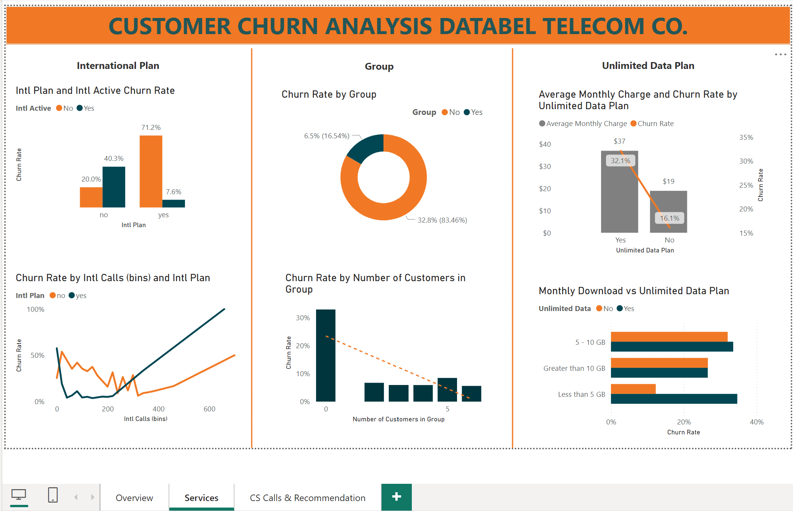

# Problem State
Churn Analysis for Databel - a telecom company, since it has a rather big churn rate - 26.9%.

I would like to explore these questions:

1. Churner Profile: we will look at Demographic, Location, Tenure & Contract Type and also reasons for churing

2. How effiective are the current additional services of Databel for the purpose of reducing churn rate? We'll talk about Unlimited Data Plan, International Plan and Group Active

3. A look at Customer Service Calls 

4. Insights & Reccommendations

# Dataset

Dataset from [kaggle](https://www.kaggle.com/datasets/yichienchong/databel-telecom-customer-churn-dataset)

Data dictionary:
- CustomerID - Unique identification for each customer
- Churn Label - Whether or not a customer has churned
- Account Length (in months) - Customer tenure
- Local Calls - Number of local calls made
- Local mins - time spent on local calls made
- Int Calls - Number of international calls made
- Intl mins - time spent on local calls made
- Intl Active - whether customer is currently subscribed to an international plan
- Intl Plan - whether or not customer ever subscribed to an international plan
- Extra International Charges - charges incurred on internatoinal calls
- Customer Service Calls - number of calls put across for help from customer service
- Avg Monthly GB Download - GB data usage of each customer per month
- Unlimited Data Plan - whether or not the customer subscribed for unlimited data.
- Phone Number - of each customer
- Gender - whether a customer is male, female or undisclosed
- Age - the age of each customer
- Contract Type - the subscription basis of each customer
- Payment Method - means of payment
- Monthly Charges - charges incurred on each customer on a monthly basis
- Total Charges - total charges incurred on each customer
- Churn Category - classes of churns
- Churn Reason - the reason for the churn of a customer
- State - customer's location
- Under 30 - whether the customer is under 30 years old
- Senior - whether the customer is older than 65 years old
- Device Protection and Online backup - whether the customer paid for device protection and online backup

# Data cleaning
- Dataset has 6687 rows, 29 columns. Each row represent a unique customer.
- Missing values in Churn Category and Churn Reason are replaced with "Unknown"

# Dashboard Structure
Dashboard created with Power BI, downloaded [here](customer-churn-analysis.pbix).

Dashboard contains 3 pages:
- Overview: general insights for churner profile
- Service: look at the effectiveness of the additional services: Unlimited Data Plan, International Plan, Group Discount
- Customer service & reccommendation: look at customer service calls, overall insights and recommendation for Databel

